# Java SpringMVC

SpringMVC 筆記

# SpringMVC

SpringMVC是基於spring的一個框架，實際上就是spring的一個模塊，專門是作WEB開發的，理解成是servlet的一個升級。

web開發底層是servlet，框架是在servlet基礎上面加入一些功能，讓web開發更方便。

SpringMVC就是一個spring。Spring是容器，IOC能夠管理對象，使用

```xml
<bean>
```
```java
@Componet
@Repository
@Service
@Controller
```

SpringMVC能夠創建對象，放入到容器中(SpringMVC容器)，SpringMVC容器中放的是控制器對象。

使用 ```@Controller```創建控制器對象，把對象放入到SpringMVC容器中，把創建的對象作為控制器使用，這個控制器對象能接收用戶的請求，顯示處理的結果，就當作是一個servlet使用。

使用 ```@Controller```註解創建的是一個普通類對象，不是servlet。SpringMVC賦予了控制器對象一些額外的功能。

web開發底層是servlet，SpringMVC中有一個對象是servlet：DispatherServlet

DispatherServlet(中央調度器)：負責接收用戶的所有請求，用戶把請求給了DispatherServlet，之後DispatherServlet把請求轉發給Controller對象，最後Controller對象處理請求。


index.jsp -> DispatherServlet(Servlet) -> 轉發分配給Controll對象(```@Controller```註解創建的對象)

# 創建新專案及新模塊

建立一個空專案，再新增模塊

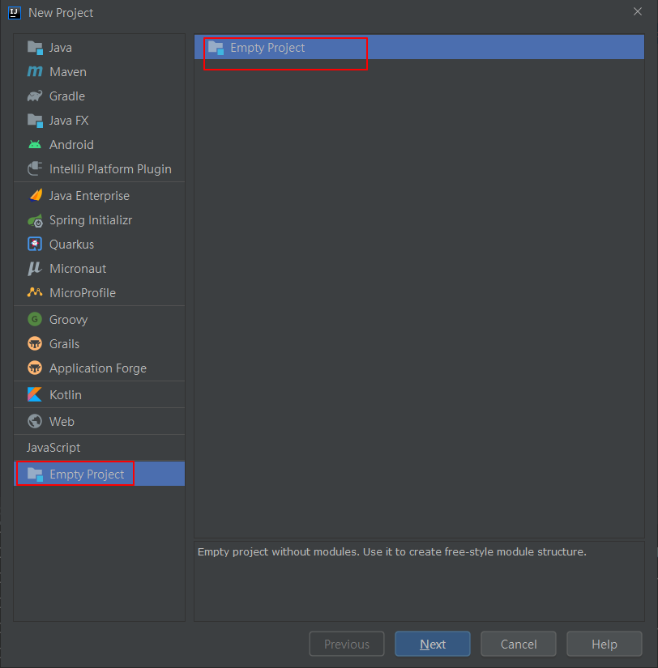

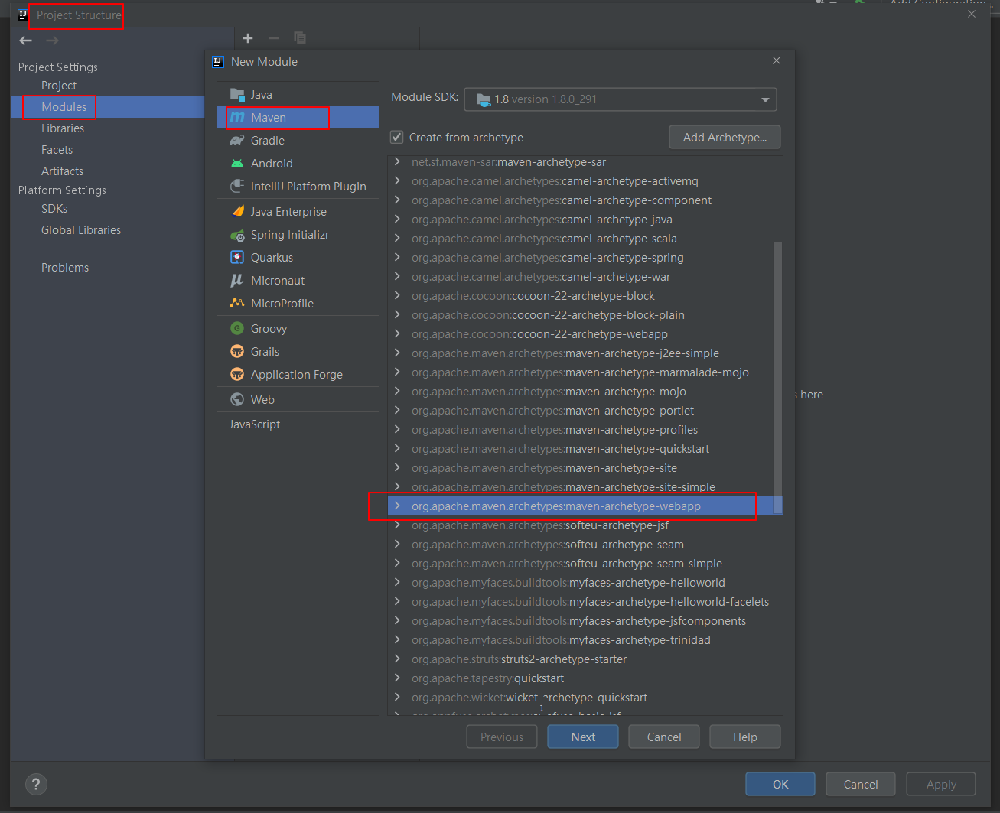

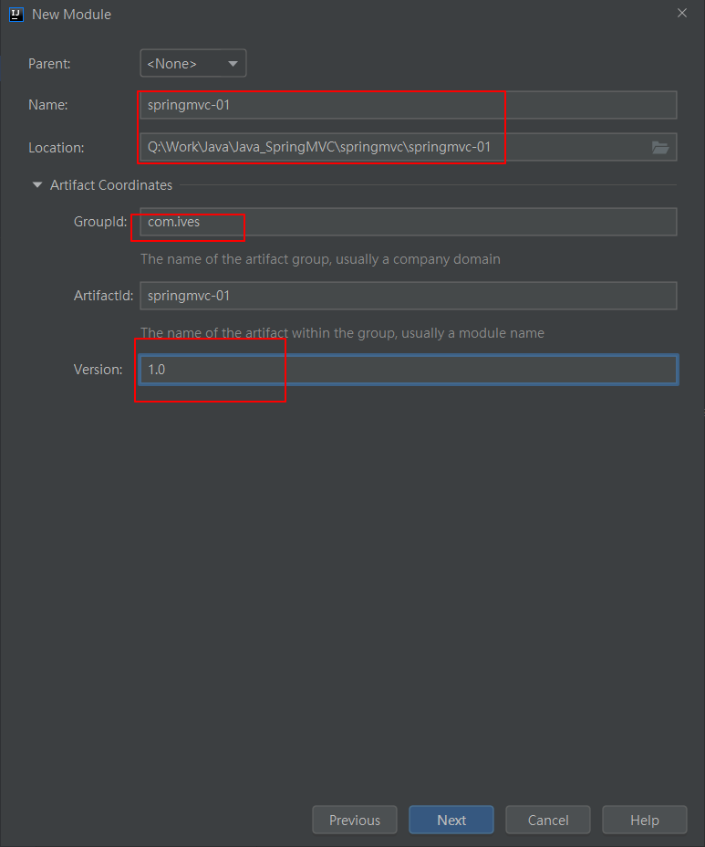

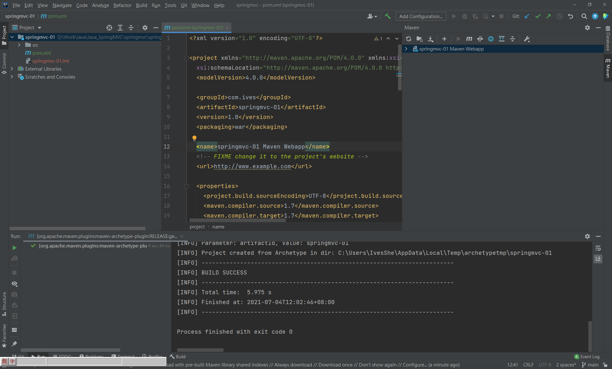

# springmvc-01：第一個SpringMVC項目

需求：用戶在頁面發起一個請求，請求交給SpringMVC的控制器對象，並顯示請求的處理結果，在結果頁面顯示一個歡迎語句。

實現步驟：

1. 新建web maven工程
2. 加入依賴：
- spring-webmvc依賴，間接把spring的依賴都加入到項目
- jsp、servlet依賴

3. 重點： 在web.xml注冊SpringMVC框架的核心對象DispatherServlet
    - DispatherServlet叫作中央調度器，是一個servlet，它的父類是繼承HttpServlet
    - DispatherServlet也叫作前端控制器(front controller)
    - DispatherServlet負責接收用戶提交的請求，調用其它的控制器對象，並把請求的處理結果顯示給用戶。

4. 創建一個發起請求的頁面 index.jsp

5. 創建控制器類
    - 在類的上面加入 ```@Controller``` 註解，創建對象，並放入到SpringMVC容器中
    - 在類中的方法上面加入```@RequestMapping```註解。

6. 創建一個作為結果的jsp，顯示請求的處理結果。

7. 創建SpringMVC的配置文件(跟spring的配置文件一樣)
    - 聲明組件掃描器，指定 ```@Controller```註解所在的包名
    - 聲明視圖解析器，幫助處理視圖。


## 加入依賴

pom.xml

```xml
<!-- https://mvnrepository.com/artifact/javax.servlet/javax.servlet-api -->
    <!--servlet依賴-->
    <dependency>
      <groupId>javax.servlet</groupId>
      <artifactId>javax.servlet-api</artifactId>
      <version>3.1.0</version>
      <scope>provided</scope>
    </dependency>

    <!-- https://mvnrepository.com/artifact/org.springframework/spring-webmvc -->
    <!--springmvc依賴-->
    <dependency>
      <groupId>org.springframework</groupId>
      <artifactId>spring-webmvc</artifactId>
      <version>5.2.5.RELEASE</version>
    </dependency>
```

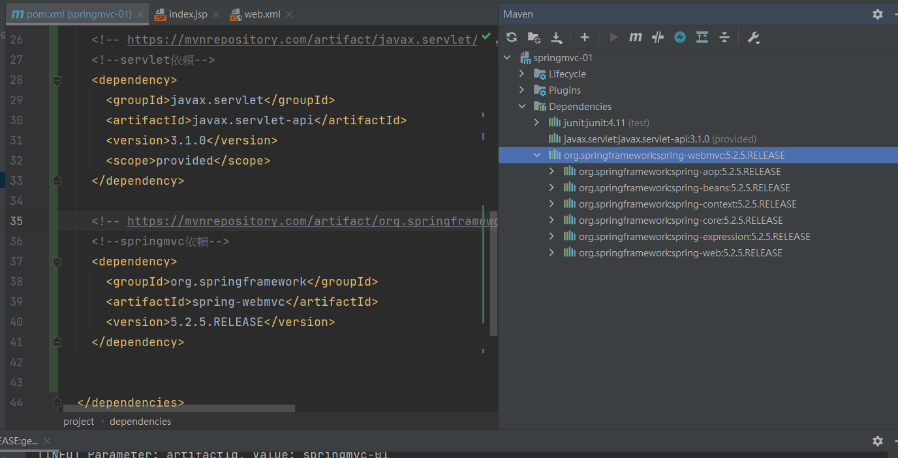

## 修改web.xml版本

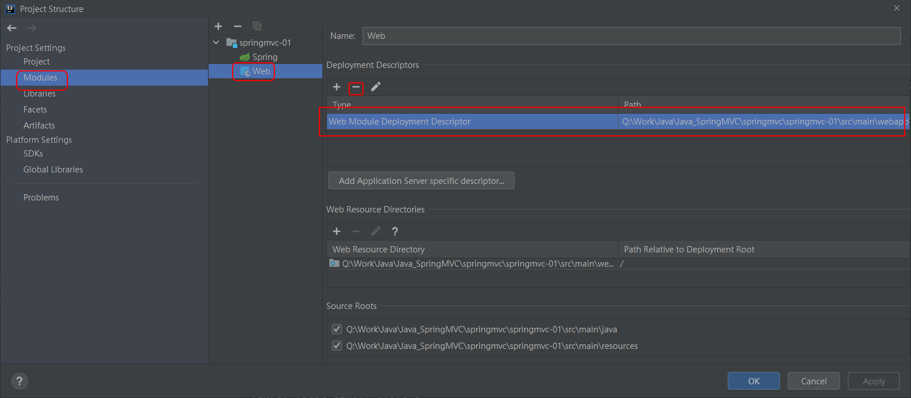

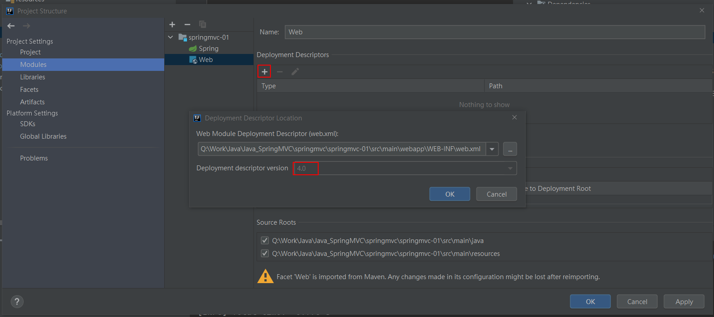

```xml
<?xml version="1.0" encoding="UTF-8"?>
<web-app xmlns="http://xmlns.jcp.org/xml/ns/javaee"
         xmlns:xsi="http://www.w3.org/2001/XMLSchema-instance"
         xsi:schemaLocation="http://xmlns.jcp.org/xml/ns/javaee http://xmlns.jcp.org/xml/ns/javaee/web-app_4_0.xsd"
         version="4.0">

    <!--聲明、註冊springmvc的核心對象DispatcherServlet
        需要在tomcat服鍪器啟動後，創建DispatcherServlet對象的實例。
        因為DispatcherServlet在創建過程中，會同時創建springmvc容器對象，
        讀取springmvc的配置文件，把這個配置文件中的對象都創建好，
        當用戶發起請求時，就可以直接使用對象了。

        servlet的初始化會執行init()方法。DispatcherServlet在init()中{
            // 創建容器，讀取配置文件
            WebApplicationContext ctx = new ClassPathXmlApplicationContext("spring.xml");
            // 把容器對象放到ServletContext中
            getServletContext().setAttribute(key,ctx);
        }

        啟動tomcat報錯，讀取這個文件失敗 /WEB-INF/springmvc-servlet.xml
        springmvc創建容器對象時，讀取的配置文件默認是/WEB-INF/<servlet-name>-servlet.xml
    -->
    <servlet>
        <servlet-name>myweb</servlet-name>
        <servlet-class>org.springframework.web.servlet.DispatcherServlet</servlet-class>

        <!--自定義springmvc讀取配置文件的位置-->
        <init-param>
            <!--springmvc配置文件的位置的屬性-->
            <param-name>contextConfigLocation</param-name>
            <!--指定自定義文件的位置-->
            <param-value>classpath:springmvc.xml</param-value>
        </init-param>
        
        <!--在tomcat啟動後，創建servlet對象
            load-on-startup：表示tomcat啟動後創建對象的順序。它的值是整數，數值愈小，
                         tomcat創建對象的時間愈早。大於等於0的整數。
        -->
        <load-on-startup>1</load-on-startup>
    </servlet>

    <servlet-mapping>
        <servlet-name>myweb</servlet-name>
        <!--
            使用框架的時候，url-pattern可以使用兩種值
            1. 使用擴展名方式，語法 *.xxx，xxxx是自定義的擴展名。常用的方式 *.do，*.action， *.mvc等等
               http://localhost:8080/myweb/some.do
               http://localhost:8080/myweb/other.do
            2. 使用斜杠 "/"
        -->
        <url-pattern>*.do</url-pattern>
    </servlet-mapping>

</web-app>
```

## 新增Tomcat服務器

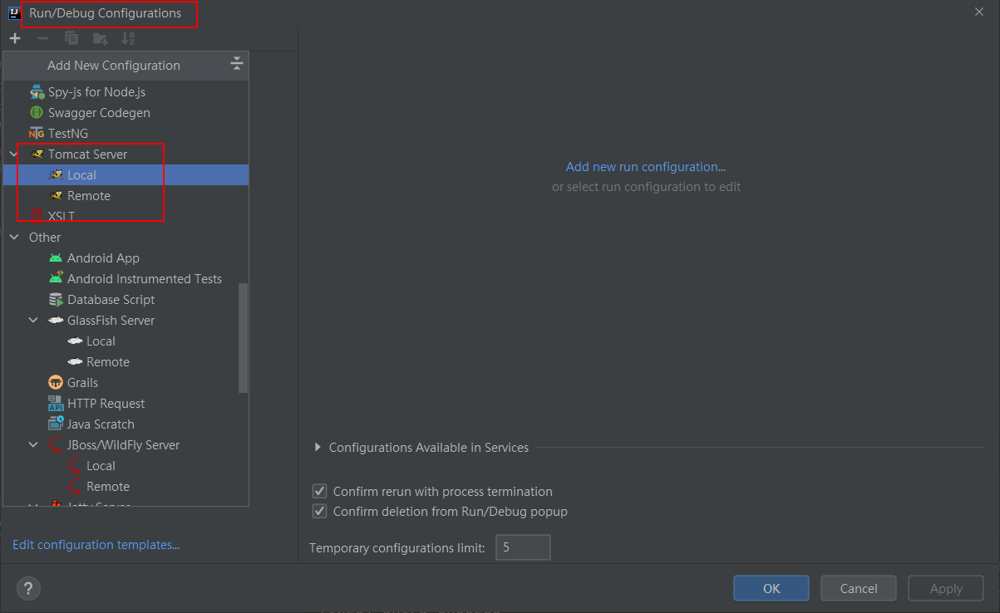

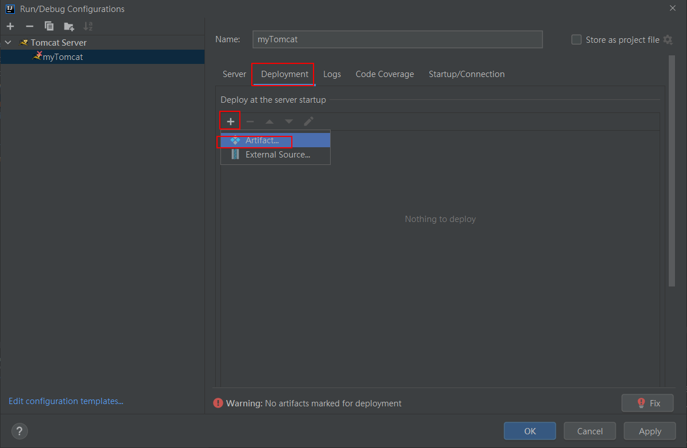

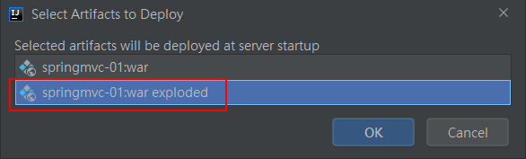

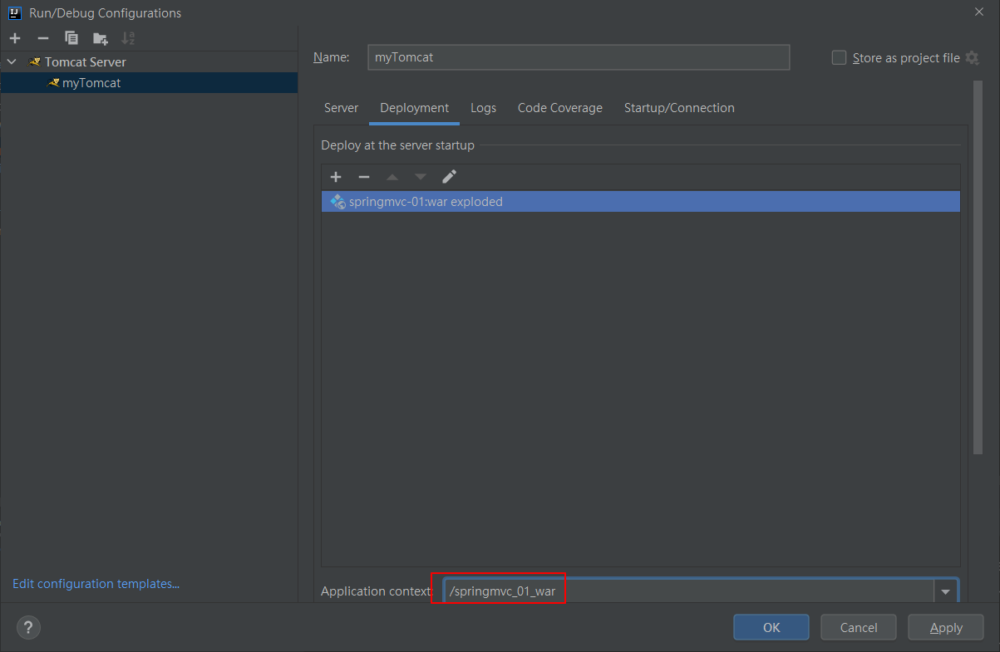

## 撰寫index.jsp

```jsp
<%@ page contentType="text/html;charset=UTF-8" language="java" %>
<html>
<head>
    <title>Title</title>
</head>
<body>
    <p>第一個SpringMVC項目</p>
    <p><a href="some.do">發起some.do的請求</a> </p>
</body>
</html>
```

## 撰寫show.jsp

```jsp
<%@ page contentType="text/html;charset=UTF-8" language="java" %>
<html>
<head>
    <title>Show</title>
</head>
<body>
    <h3>show.jsp從request作用域獲取數據</h3><br/>
    <h3>msg數據：${msg}</h3><br/>
    <h3>fun數據：${fun}</h3><br/>
</body>
</html>
```

## 創建MyController

MyController.java
```java

/**
 * @Controller：創建處理器對象，對象放在springmvc容器中。
 * 位置：在類的上面
 * 和sping中的@Service、 @Component相同，都是創建對象的
 *
 * 能處理請求的都是控制器(處理器)：
 * MyController能處理請求，叫作後端控制器(back controller)
 */
@Controller
public class MyController {
    /*
        處理用戶提交的請求，springmvc中是使用方法來處理。
        方法是自定義的，可以有多種返回值，多種參數，方法名稱自定義
     */

    /**
     * 准備使用doSome方法處理some.do請求
     * @RequestMapping：請求映射，作用是把一個請求地址和一個方法綁在一起。
     *                  一個請求指定一個方法處理。
     *         屬性： 1. value是一個String，表示請求的uri地址(some.do)。
     *                  value的值必須是唯一的，不能重複。
     *                  在使用時，推薦地址以"/"
     *         位置： 1. 在方法的上面，常用的。
     *               2. 在類的上面
     * 說明： 使用RequestMapping修飾的方法叫作處理器方法或者控制器方法。
     * 使用@RequestMapping修飾的方法可以處理請求，類似Servlet中的doGet,doPost
     *
     * 返回值： ModelAndView表示本次請求的處理結果
     * Model： 數據，請求處理完成後，要顯示給用戶的數據
     * View： 視圖，比如jsp等。
     */
    @RequestMapping(value = "/some.do")
    public ModelAndView doSome(){   // doGet() -- service請求處理
        // 處理some.do請求。相當於service調用處理完成了。
        ModelAndView mv = new ModelAndView();
        // 添加數據，框架在請求的最後把數據放入到request作用域
        // request.setAttribute("msg","歡迎使用SpringMVC");
        mv.addObject("msg","歡迎使用SpringMVC");
        mv.addObject("fun","執行的是doSome方法");

        // 指定視圖的完整路徑
        // 框架對視圖執行的forward操作，request.getRequestDispatcher("/show.jsp).forward(...)
        mv.setViewName("show.jsp");

        // 返回mv
        return mv;
    }
}
```

## 創建springmvc.xml

```xml
<?xml version="1.0" encoding="UTF-8"?>
<beans xmlns="http://www.springframework.org/schema/beans"
       xmlns:xsi="http://www.w3.org/2001/XMLSchema-instance"
       xmlns:context="http://www.springframework.org/schema/context"
       xsi:schemaLocation="http://www.springframework.org/schema/beans http://www.springframework.org/schema/beans/spring-beans.xsd http://www.springframework.org/schema/context https://www.springframework.org/schema/context/spring-context.xsd">

    <!--聲明組件掃描器-->
    <context:component-scan base-package="com.ives.controller"/>
</beans>
```

## 運行tomcat，並訪問

http://localhost:8080/springmvc_01_war/

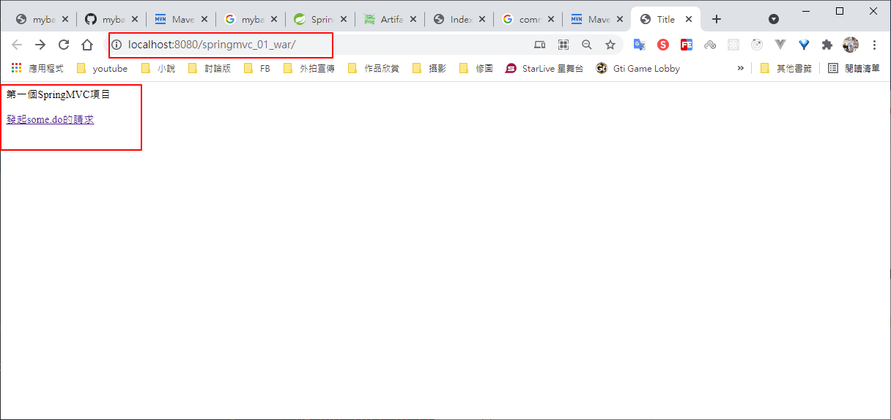

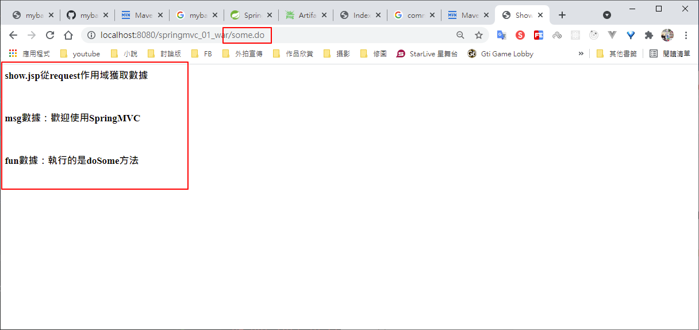